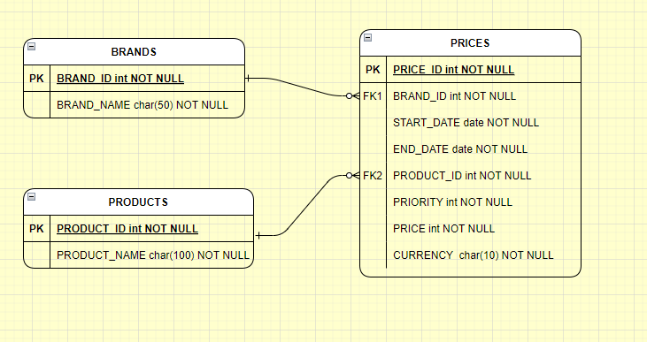

# Prueba tecnica Inditex

El proyecto a continuación presenta una solución al caso de consulta de precios aplicados en Inditex,
se realiza bajo lenguaje de programacion Java con el marco de trabajo SpringBoot y base de datos H2.
Adicionalmente, se complementa utilizando arquitectura hexagonal.


### Pre-requisitos 

-Maven <br>
-Lombok

### Base de datos 

Diagrama relacional de la base de datos




### Instalación 

Generar proyecto por maven

```
mvn clean install
```

Ejecutar proyecto por maven

```
mvn spring-boot:run

```
### Uso

Luego de ejecutar el proyecto, podemos visualizar la información de la api a través de la herramienta swagger con el siguiente link de acceso: [http://localhost:8080/swagger-ui.html#/](http://localhost:8080/swagger-ui.html#/ "Swagger UI") Adicionalmente se puede utilizar la colección de Postman con los casos de prueba

### Consulta de precio aplicado

<bold>Endpoint para consultar precio aplicado a un producto especifico</bold>

```
GET(/v1/inditex/price?date={date}&productId={productId}&brandId={brandId})   

```
